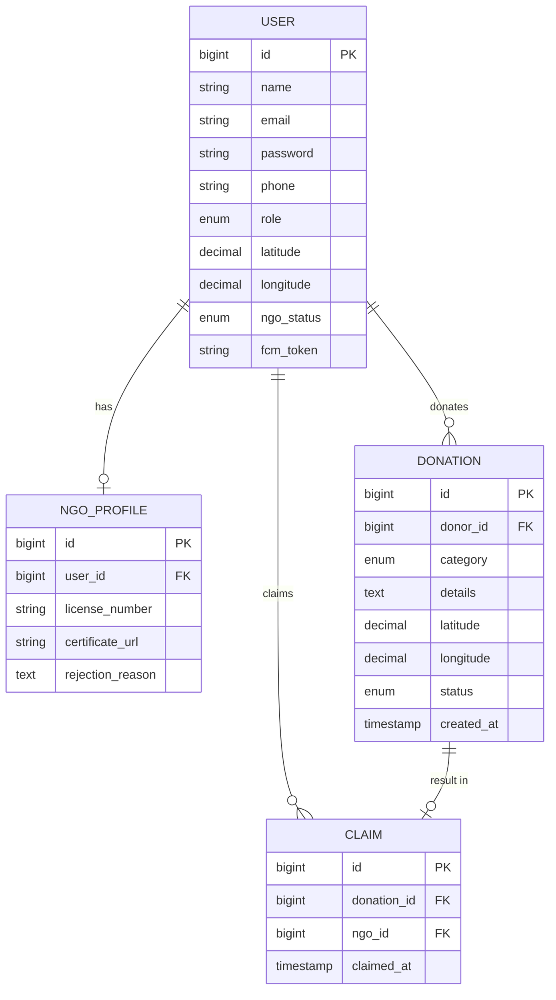
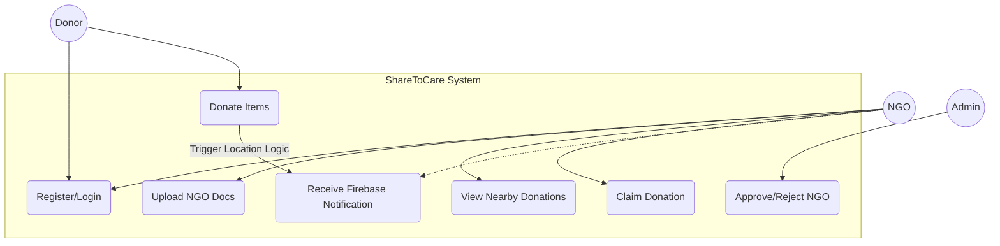
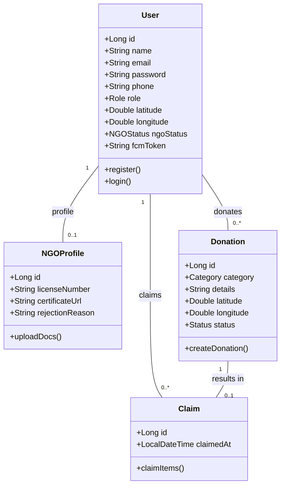
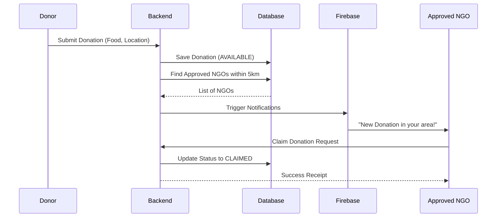

# ShareToCare Design Documentation

This document provides the architectural design for the ShareToCare platform, detailing the data structures and system interactions.

## 1. Entity Relationship Diagram (ERD)

The following diagram illustrates the relationships between Users, NGO Profiles, Donations, and Claims.

## 2. Table Design Schema

### Table: `users`
| Column | Type | Constraints | Description |
| :--- | :--- | :--- | :--- |
| `id` | BIGINT | PRIMARY KEY | Unique ID |
| `name` | VARCHAR(255) | NOT NULL | Full name |
| `email` | VARCHAR(255) | UNIQUE, NOT NULL | Login credential |
| `password` | VARCHAR(255) | NOT NULL | BCrypt hashed password |
| `phone` | VARCHAR(20) | | Contact number |
| `role` | ENUM | DONOR, NGO, BOTH, ADMIN | System role |
| `latitude` | DECIMAL(10,8) | | Address latitude |
| `longitude` | DECIMAL(11,8) | | Address longitude |
| `ngo_status` | ENUM | PENDING, APPROVED, REJECTED | Verification status |
| `fcm_token` | VARCHAR(255) | | For Firebase Notifications |

### Table: `ngo_profiles`
| Column | Type | Constraints | Description |
| :--- | :--- | :--- | :--- |
| `id` | BIGINT | PRIMARY KEY | Unique ID |
| `user_id` | BIGINT | FOREIGN KEY (users.id) | Link to user |
| `license_number` | VARCHAR(100) | | Gov. registered license |
| `certificate_url` | VARCHAR(500) | | Storage URL for doc |
| `rejection_reason`| TEXT | | Reason if rejected |

### Table: `donations`
| Column | Type | Constraints | Description |
| :--- | :--- | :--- | :--- |
| `id` | BIGINT | PRIMARY KEY | Unique ID |
| `donor_id` | BIGINT | FOREIGN KEY (users.id) | Who donated? |
| `category` | ENUM | FOOD, CLOTHES, BOOKS, GAMES | Category |
| `details` | TEXT | | Item description |
| `latitude` | DECIMAL(10,8) | | Pick-up latitude |
| `longitude` | DECIMAL(11,8) | | Pick-up longitude |
| `status` | ENUM | AVAILABLE, CLAIMED, EXPIRED | Current state |
| `created_at` | TIMESTAMP | DEFAULT NOW() | Time of donation |

### Table: `claims`
| Column | Type | Constraints | Description |
| :--- | :--- | :--- | :--- |
| `id` | BIGINT | PRIMARY KEY | Unique ID |
| `donation_id` | BIGINT | FOREIGN KEY (donations.id) | Which donation? |
| `ngo_id` | BIGINT | FOREIGN KEY (users.id) | Which NGO? |
| `claimed_at` | TIMESTAMP | DEFAULT NOW() | Time of claim |

---

## 3. UML Diagrams

### A. Use Case Diagram
Describes the interactions between actors (Donor, NGO, Admin) and the system.

### B. Class Diagram
Illustrates the structure of the system by showing its classes, their attributes, and relationships.

### C. Sequence Diagram (Donation & Notification Flow)
Visualizes the step-by-step process of a donation event.

